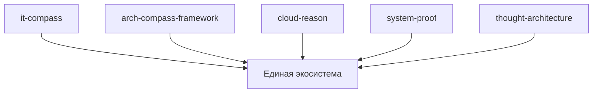

# Архитектура Portfolio System Architect

## Обзор

Демонстрационный репозиторий для показа системного мышления архитектора. Репозиторий содержит документацию, диаграммы и кейсы, демонстрирующие архитектурный подход к интеграции 6+ проектов.

## Архитектурные принципы

### Модульность
Система разбита на четко определенные модули с минимальными зависимостями между ними.

### Масштабируемость
Архитектура поддерживает горизонтальное и вертикальное масштабирование.

### Надежность
Система устойчива к сбоям и обеспечивает высокую доступность.

### Безопасность
Система обеспечивает защиту данных и ресурсов от несанкционированного доступа.

### Производительность
Система обеспечивает высокую производительность и минимальные задержки.

## Компоненты системы

### Методология
- Системное мышление
- Архитектурные принципы

### Интеграция
- Кейсы интеграции компонентов

### Диаграммы
- Компонентные диаграммы
- Диаграммы интеграции
- Диаграммы принципов

### Шаблоны
- Шаблоны README.md
- Шаблоны ARCHITECTURE.md

## Диаграммы архитектуры

### Диаграмма компонентов

## Интерфейсы интеграции

### API компонентов
Каждый компонент предоставляет REST API для взаимодействия с другими компонентами.

### Событийная модель
Компоненты используют событийную модель для асинхронного взаимодействия.

## Масштабирование и развитие

### Горизонтальное масштабирование
Компоненты могут масштабироваться горизонтально путем добавления дополнительных экземпляров.

### Вертикальное масштабирование
Компоненты могут масштабироваться вертикально путем увеличения ресурсов.

## Безопасность и надежность

### Управление доступом
Каждый компонент имеет собственную систему управления доступом.

### Надежность
Компоненты обеспечивают отказоустойчивость и автоматическое восстановление.

## Мониторинг и логирование

### Мониторинг состояния
Каждый компонент предоставляет метрики для мониторинга состояния.

### Логирование
Компоненты ведут подробное логирование для диагностики проблем.

## Заключение

Репозиторий демонстрирует системный подход к архитектуре, показывая как различные компоненты могут быть интегрированы в единую экосистему с использованием архитектурных принципов и методологий.