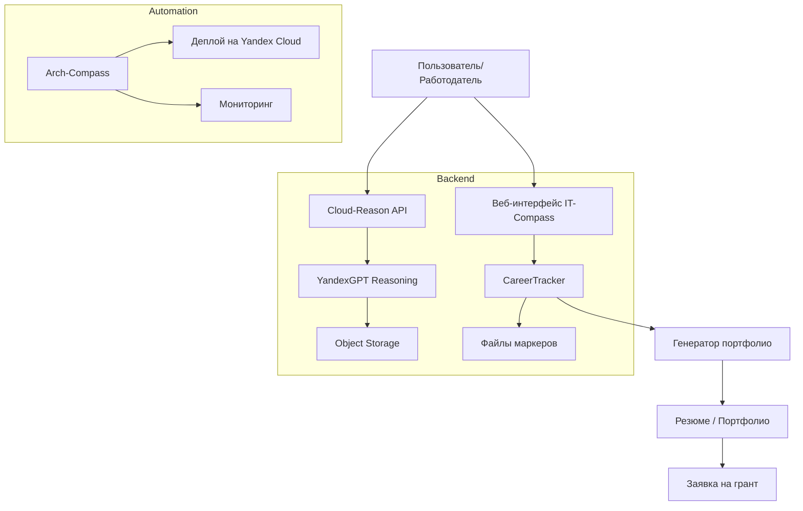

# MVP План для гранта SourceCraft (до 31 марта)

## Цель
Создать минимально рабочий прототип, демонстрирующий **системное мышление и автоматизацию карьерного роста**, для подачи заявки на грант.

## Ключевые компоненты MVP

### 1. **Cloud-Reason (Reasoning API)**
- **Статус**: Работает (Yandex Cloud Functions + API Gateway)
- **Действия для MVP**:
  - Проверить работоспособность эндпоинтов (`/health`, `/chat`)
  - Добавить простой RAG‑интерфейс для анализа файлов проекта
  - Документировать API в Swagger

### 2. **IT-Compass (Трекер компетенций)**
- **Статус**: Есть код `tracker.py`, но нет веб‑интерфейса
- **Действия для MVP**:
  - Запустить веб‑интерфейс (Streamlit или FastAPI) для отображения прогресса
  - Подключить загрузку маркеров из `src/data/markers/`
  - Показать дашборд с выполненными/ожидающими маркерами

### 3. **Portfolio‑Organizer (Автоматическая генерация портфолио)**
- **Статус**: Есть заготовка `ITCompassAPI.py`, но функционал ограничен
- **Действия для MVP**:
  - Создать скрипт, который анализирует прогресс IT‑Compass и генерирует Markdown‑резюме
  - Интегрировать с Cloud‑Reason для генерации описаний проектов
  - Вывести результат в `docs/portfolio.md`

### 4. **Arch‑Compass‑Framework (PowerShell оркестрация)**
- **Статус**: Готовые модули, но нет интеграции
- **Действия для MVP**:
  - Использовать для автоматического развёртывания компонентов
  - Написать скрипт `deploy‑mvp.ps1`, который запускает Cloud‑Reason и IT‑Compass

### 5. **Документация и демонстрация системного мышления**
- **Статус**: Частично есть в README
- **Действия для MVP**:
  - Создать архитектурную диаграмму (Mermaid) всех компонентов
  - Написать пояснение, как система демонстрирует **системное мышление** (целостность, обратная связь, ограничения как драйвер)
  - Подготовить презентацию для гранта (1‑2 страницы)

## Архитектура MVP

## План по дням (25–31 марта)

| День | Задача |
|------|--------|
| **25 марта** | – Завершить анализ уникальных файлов и перенести их в целевую структуру – Перестроить индекс SourceCraft |
| **26 марта** | – Запустить Cloud‑Reason и проверить все эндпоинты – Создать веб‑интерфейс для IT‑Compass |
| **27 марта** | – Интегрировать IT‑Compass с Cloud‑Reason (RAG‑запросы) – Написать скрипт генерации портфолио |
| **28 марта** | – Написать PowerShell‑скрипт развёртывания – Создать архитектурную диаграмму и документацию |
| **29 марта** | – Тестирование всей цепочки – Подготовка материалов для гранта |
| **30 марта** | – Финальная проверка и отправка заявки |
| **31 марта** | – Дедлайн подачи гранта |

## Что получит пользователь к 31 марта

1. **Работающий прототип** с веб‑интерфейсом IT‑Compass и Reasoning API.
2. **Автоматически генерируемое портфолио** на основе объективных маркеров.
3. **Документацию**, демонстрирующую системное мышление и архитектурные решения.
4. **Готовую заявку на грант** с ссылками на работающую систему.

## Следующие шаги после гранта

- Полная автоматизация (поиск вакансий, рассылка портфолио, общение с рекрутерами)
- Расширение RAG‑индекса на все заметки и диалоги
- Интеграция с LinkedIn/HH API
- Публикация системы как open‑source для сообщества

---

**Вопрос к пользователю:**  
Устраивает ли вас этот план? Нужны ли корректировки в приоритетах или объёме работ?