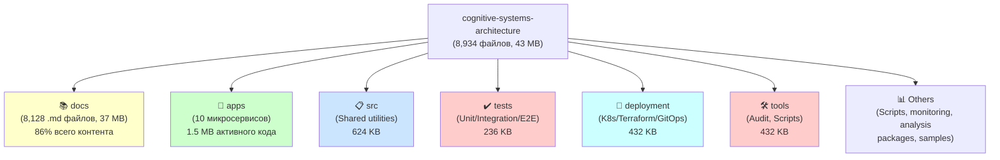
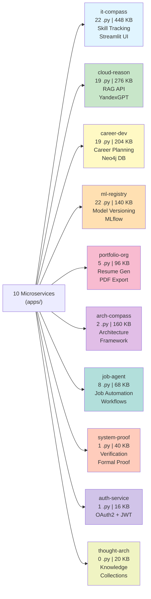
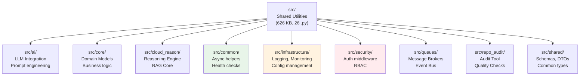
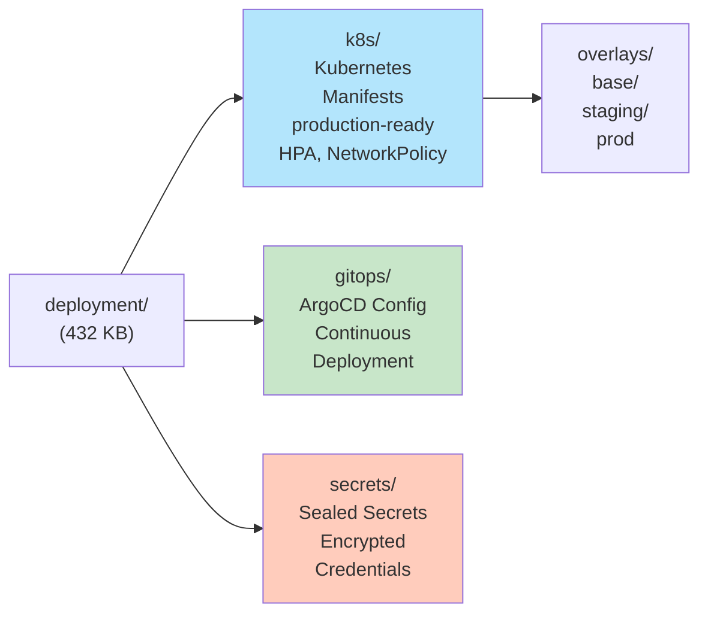
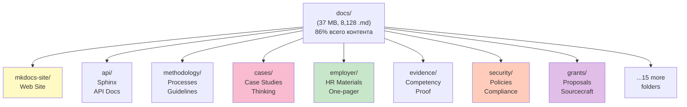
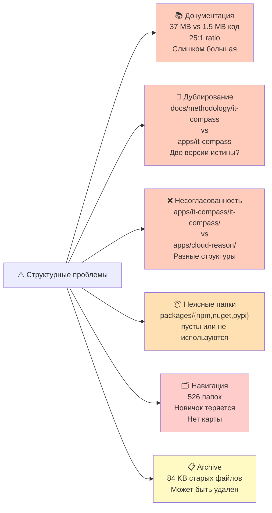
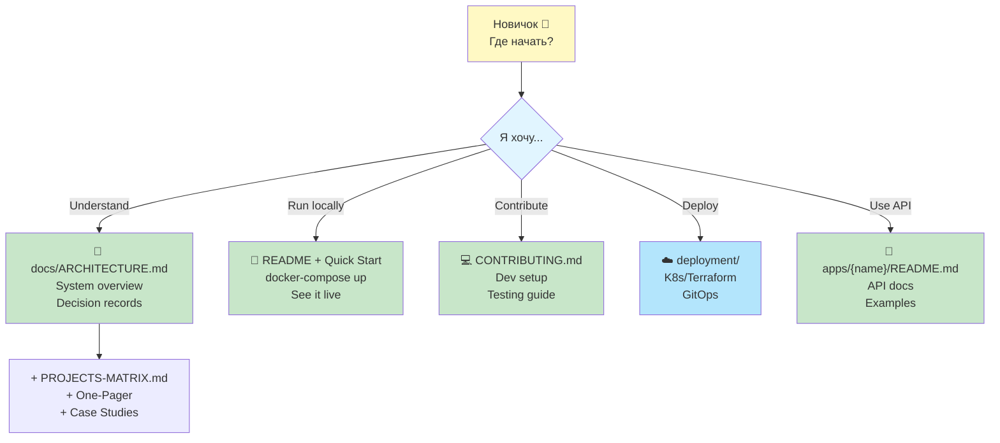

# 📊 Визуальная карта структуры репозитория

## Общая архитектура



## Структура микросервисов



## Структура src/ (Shared Code)



## Структура deployment/



## Структура docs/ (Документация)



## Проблемные точки структуры



## Рекомендуемая иерархия навигации для новичка



## Рекомендации по архитектуре каталогов

### 1. Standardize app structure
```
apps/it-compass/
├── Dockerfile
├── src/
│   ├── main.py          ← Entry point
│   ├── api/             ← FastAPI routes
│   ├── models/          ← Data models
│   ├── core/            ← Business logic
│   └── utils/           ← Helpers
├── tests/
│   ├── unit/
│   ├── integration/
│   └── e2e/
├── pyproject.toml
├── poetry.lock
├── README.md
└── .env.example
```

### 2. Restructure docs with priority
```
docs/
├── 0_QUICKSTART.md     ← MUST READ FIRST (New users)
├── 1_ARCHITECTURE.md   ← System design
├── 2_SERVICES.md       ← All 10 microservices
├── 3_DEPLOYMENT.md     ← Run on K8s/Cloud
├── 4_SECURITY.md       ← Compliance, secrets
├── 5_CONTRIBUTING.md   ← How to contribute
├── 6_API_REFERENCE.md  ← Auto-generated from Sphinx
└── archive/            ← Move old methodology here
```

### 3. Clean up packages/
```
Delete:
  packages/npm/         (not used)
  packages/nuget/       (not used)
  packages/pypi/        (not used)

Keep only:
  packages/terraform/   (active)
```
