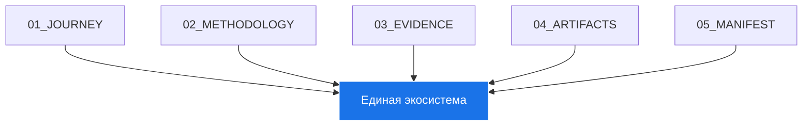

# 🏗️ Архитектура Portfolio System Architect

> **Единая экосистема архитектора когнитивных систем**

---

## 🎯 Цель

Создать **единый, целостный, живой репозиторий `portfolio-system-architect`**, который:
- Станет **главным доказательством моей экспертизы**
- Покажет **системное мышление как архитектурную компетенцию**
- Будет готов к подаче на **грант Sourcecraft Open Source**
- Ответит на вопрос:
  > «Кто ты?» →
  > «Я — архитектор когнитивных систем. Я создаю системы, где человек управляет ИИ для проектирования сложных экосистем.»

---

## 🧩 Компоненты

### 1. 01_JOURNEY
- **Назначение**: Путь (доказательство эволюции)
- **Функции**:
  - Документирование эволюции от Excel-таблицы к методологии
  - Демонстрация преодоления хаоса через RAG и Reasoning
  - Показ эволюции от отдельных проектов к экосистеме

### 2. 02_METHODOLOGY
- **Назначение**: Ядро (то, что создано)
- **Функции**:
  - Определение методологии объективных маркеров компетенций
  - Реализация архитектурного фреймворка
  - Систематизация маркеров компетенций по областям
  - Поддержка развития карьеры

### 3. 03_EVIDENCE
- **Назначение**: Доказательства (что работает)
- **Функции**:
  - Индексация и обработка тысяч файлов через RAG-систему
  - Реализация циклов анализа через ИИ
  - Автоматическая генерация портфолио

### 4. 04_ARTIFACTS
- **Назначение**: Артефакты (результаты)
- **Функции**:
  - Сбор и систематизация кейсов применения из диалогов
  - Создание демонстраций (HTML, скрипты)
  - Подготовка материалов для гранта

### 5. 05_MANIFEST
- **Назначение**: Манифест (кто я теперь)
- **Функции**:
  - Формулирование новой профессиональной роли
  - Документирование архитектуры системы
  - Полное описание методологии

---

## 🔄 Интеграция

### 1. Единая точка входа
- Все компоненты интегрированы через `cognitive-architect-manifesto/`
- Единая документация и методология

### 2. Автоматизация
- Ежедневная генерация карты знаний и сайта
- Автообновление через GitHub Actions

### 3. Живая система
- Постоянное обновление и развитие
- Открытость для вкладов

---

## 🛠️ Техническая реализация

### 1. Языки и фреймворки
- **Python**: основной язык программирования
- **Markdown**: документация
- **Mermaid**: диаграммы
- **HTML/CSS/JS**: веб-сайт
- **PowerShell**: скрипты автоматизации

### 2. Инструменты
- **Git**: система контроля версий
- **GitHub Actions**: CI/CD
- **Obsidian**: карта знаний
- **Bootstrap**: фронтенд

### 3. Автоматизация
- **generate_obsidian_map.py**: генератор карты знаний
- **generate_website.py**: генератор сайта
- **run_daily.ps1**: ежедневная автоматизация

---

## 📈 Эволюция

### 1. Итерации
- Постоянное улучшение компонентов
- Адаптация к новым требованиям

### 2. Обратная связь
- Вклад сообщества
- Анализ использования

### 3. Масштабирование
- Расширение функциональности
- Интеграция с новыми инструментами

---

## 🏆 Грант Sourcecraft Open Source

> «Этот репозиторий — результат двух лет экспериментов, ошибок и прорывов.
> Здесь я переопределяю роль архитектора в эпоху ИИ.
> Я не пишу код — я проектирую системы, где человек управляет ИИ для создания новых форм экспертизы.
> Этот проект — мой вклад в будущее профессии.»