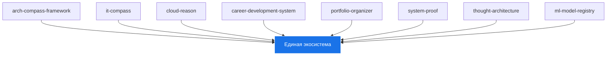

# Architecture

Архитектура Portfolio System Architect.

Компоненты интегрированы через Docker Compose и GitHub Actions.

**Methodology**: [Methodology →](../methodology/)

**Components**:
- IT-Compass: Markers tracking
- Arch-Compass: PowerShell framework
- Cloud-Reason: RAG API

Подробнее в [Modules](../modules/)

