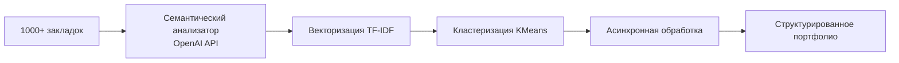

# Architecture Diagram

- **Путь**: `03_CASES\thinking-cases\03-bookmark-architecture-design\architecture-diagram.md`
- **Тип**: .MD
- **Размер**: 423 байт
- **Последнее изменение**: 1773162168.0596335

## Предпросмотр

```
# Диаграмма архитектуры системы управления закладками


