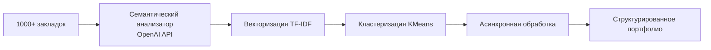

# Architecture Diagram

- **Путь**: `components\thought-architecture\cases\03-bookmark-architecture-design\architecture-diagram.md`
- **Тип**: .MD
- **Размер**: 415 байт
- **Последнее изменение**: 1772442031.3588927

## Предпросмотр

```
# Диаграмма архитектуры системы управления закладками


