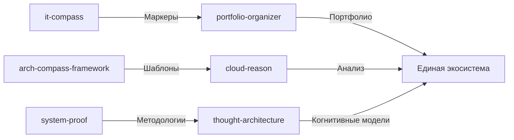

# Detailed

- **Путь**: `diagrams\integration\detailed.md`
- **Тип**: .MD
- **Размер**: 435 байт
- **Последнее изменение**: 1771483368.3703957

## Предпросмотр

```
# Детальная диаграмма интеграции


