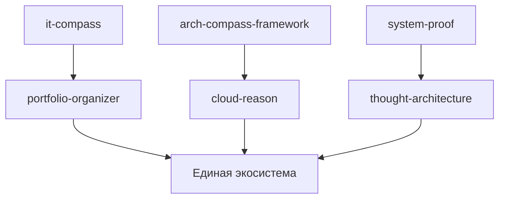

# Diagrams Components Overview.Md

- **Путь**: `docs\obsidian-map\diagrams_components_overview.md.md`
- **Тип**: .MD
- **Размер**: 517 байт
- **Последнее изменение**: 1772467523.8187413

## Предпросмотр

```
# Overview

- **Путь**: `diagrams\components\overview.md`
- **Тип**: .MD
- **Размер**: 279 байт
- **Последнее изменение**: 1771483368.4016473

## Предпросмотр

```
# Диаграмма компонентов



```
